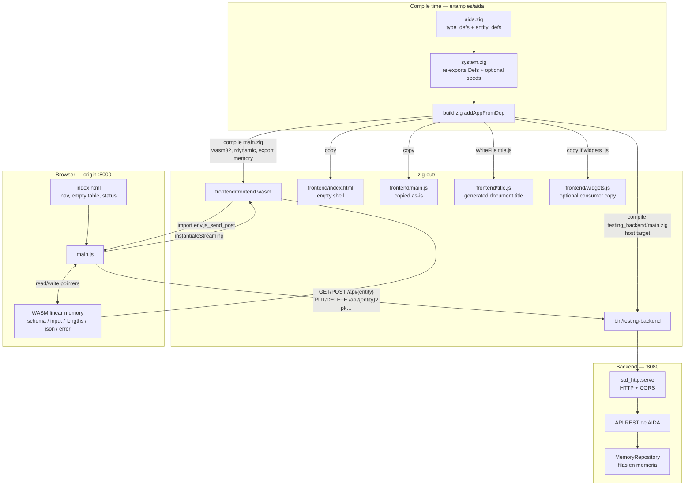

# Frontend layer

How to run the example: [run-example.md](run-example.md). Build graph: [build.md](build.md). Vocabulary (Defs → Infos): [zigma.md](zigma.md).

The page is **not** HTML/JS emitted from Zig at compile time. `src/frontend/` is a generic client: it knows `zigma`, `zigma_json`, and a `system` module (`type_defs` + `entity_defs`). The aida example is a consumer package: `examples/aida/build.zig` calls `addAppFromDep` with `src/system.zig` as `system`, `src/widgets.js` as `widgets_js`, and `title = "aida"`. The table is built **at runtime** from entity Infos that live in the WASM module. JS never imports a concrete system; domain-type widgets are an optional consumer map loaded from `./widgets.js`.

This document is the layer in detail: first how the pieces sit together, then every function call on each user flow.

---

## 1. Mid-high level: parts and how they interact

Three runtimes, one `system` file compiled twice (host vs `wasm32-freestanding`). The descriptor (`zigma`) does not import generators. Both generators import `zigma` and the injected `system`.



**What each arrow means**

| Boundary | Contract |
| --- | --- |
| `system.zig` → WASM | Same `type_defs` / `entity_defs` baked into `frontend.wasm`. Catalog JSON is `stringifyEntityCatalog` of those Defs (Infos via `completeEntity`). Seeds are **not** in WASM. |
| `system.zig` → HTTP | Same Defs plus optional `seeds`. Seeds se convierten a celdas del repositorio en memoria al iniciar. |
| HTML → JS | Shell only: `#entity-nav`, `#sheet-title`, `#sheet-table` (`thead`/`tbody`/`tfoot`), `#status`. `<script src="title.js">` sets `document.title` from `addApp` `.title` (empty if omitted). No columns until JS runs. |
| JS → WASM exports | Pointer/length accessors plus `build_row(entity_index)` / `create_row(entity_index)`. `entity_index` is field order on `entity_defs` (same order as the catalog array). |
| WASM → JS import | `env.js_send_post(ptr, len)`: Zig has already written row JSON into `json_buf`; JS reads that slice and `fetches` `POST`. Zig does **not** await the Promise (the POST is fire-and-forget from WASM’s point of view; JS still `await`s inside the import). |
| JS → HTTP | Hard-coded `http://localhost:8080/api`. CORS `*` mediante el transporte compartido `zigma_std_http`. Identity for PUT/DELETE is the query string (pk fields). POST has no query. GET may include equality filters. PUT body omits PKs. Domain values (including `fecha` objects) follow the codecs / WASM row JSON. |

**Responsibility split (why WASM exists)**

JS owns DOM, navigation, `fetch`, and packing cell **strings** into WASM memory. Zig owns typing: `RecordInstanceType` + `parseFieldValue` + `stringifyRecord`. A cell that is not a value of that field’s Zig type never becomes a POST/PUT body; the page shows `error: {field}: not {storage}` from `error_ptr`.

Buffers live in WASM (not allocated from JS):

| Buffer | Size | Role |
| --- | --- | --- |
| `schema_buf` | 32768 | Catalog JSON, filled once on first `schema_ptr` / `schema_len` |
| `input_buf` | 8192 | Concatenated UTF-8 cell strings |
| `lengths_buf` | `max_field_count` × `usize` | Length of each packed field, in entity field order |
| `json_buf` | 8192 | Last successfully built row JSON |
| `error_buf` | 256 | Last `build_row` / `create_row` error message |

`max_field_count` is the largest `.fields` count among entities in `entity_defs` (comptime).

---

## 2. Catalog JSON the page actually sees

On first read of `schema_ptr` / `schema_len`, WASM calls `zigma_json.stringifyEntityCatalog(type_defs, entity_defs, &schema_buf)`. That walks every entity name on `entity_defs` and, per entity, `stringifyEntitySchema` → `zigma.completeEntity` then writes one object:

- `name` — entity name (struct field on `entity_defs`)
- `pk`, `uks`, `fks` — completed keys (fks already source→target maps)
- `fields` — array of `{ name, label, type, is_name, storage }`
  - `type` is the **domain** type name (`text`, `legajo`, `fecha`, …)
  - `is_name` is the completed field flag (`true` if this column is the row’s display name)
  - `storage` is the **Zig** shape used by widgets: `text` / `integer` / `boolean` / `object`
  - a struct also has nested `fields` (`name` + `storage`, recursively)

That catalog is the only schema the page uses.

---

## 3. Function-call traces for each flow

Notation: `file: function` then callees. Browser APIs are included when they are part of the contract.

### 3.1 Build (no browser)

```
examples/aida/build.zig
  └─ @import("zigma_definition").addAppFromDep(b, dep, .{ .system_root, .rest_root, .aida_root?, .widgets_js?, .title?, .target, .optimize })
       └─ build.zig: addApp
            ├─ zigmaModule / jsonModule / systemModule   (host)
            │    └─ testing-backend executable ← src/testing_backend/main.zig
            ├─ zigmaModule / jsonModule / systemModule   (wasm32-freestanding, .small)
            │    └─ frontend executable ← src/frontend/main.zig
            │         .entry = .disabled, .rdynamic, .export_memory
            ├─ install artifact → zig-out/frontend/frontend.wasm
            ├─ installFile      → zig-out/frontend/main.js     (copy)
            ├─ installFile      → zig-out/frontend/index.html  (copy)
            ├─ WriteFile        → zig-out/frontend/title.js    (`document.title` from `.title`)
            └─ installFile      → zig-out/frontend/widgets.js  (copy if `widgets_js`)
```

The library `zig build` at the repo root does **not** install this app. Generators under `src/` **are** in the published package so a consumer can call `addAppFromDep`.

---

### 3.2 Page load → catalog → first table

Triggered by the browser loading `index.html` (`<script src="title.js">` then `<script src="main.js">`). Status text starts as `Loading...`.

```
browser
  └─ fetch("index.html") → parse DOM (empty nav, empty table)
       ├─ fetch("title.js") → document.title from addApp `.title`
       └─ fetch("main.js") → execute

main.js  (top level)
  └─ loadWidgets()
       import("./widgets.js") → widgets = mod.widgets ?? {}
       missing file → widgets = {}
       then WebAssembly.instantiateStreaming(fetch("frontend.wasm"), importObject)
       │  importObject.env.js_send_post = async (ptr, len) => { … }  // registered, not called yet
       │
       ├─ [success]
       │    wasmExports = obj.instance.exports
       │    window.wasmInstance = obj.instance
       │    catalog = JSON.parse(
       │         readWasmString(schema_ptr, schema_len)
       │    )
       │
       │    readWasmString(ptrFn, lenFn)
       │      └─ readMemoryString(ptrFn(), lenFn())
       │           └─ TextDecoder.decode(memory.subarray(ptr, ptr+len))
       │
       │    WASM (first schema_ptr or schema_len):
       │      schema_ptr() / schema_len()
       │        └─ schemaBytes()
       │             if !schema_ready:
       │               zigma_json.stringifyEntityCatalog(type_defs, entity_defs, &schema_buf)
       │                 for each entity name:
       │                   stringifyEntitySchema(…)
       │                     zigma.completeEntity(entity_def)
       │                     writeNameList(pk), writeUks, writeFks
       │                     writeEntityFields → fieldStorage(zig_type)
       │                       if struct: writeNestedFields
       │             schema_ready = true
       │
       │    fromHash = location.hash without '#'
       │    selectEntity(fromHash || catalog[0].name)
       │    status cleared after load (no "Ready.")
       │    addEventListener("hashchange", …)
       │
       └─ [failure]
            status ← String(err)
            console.error(err)
```

`selectEntity` is the shared “show this entity” entry (also used on hash change). Continue in §3.3.

---

### 3.3 Select entity (initial load or hash change)

Hash change handler: if `location.hash` name is non-empty and different from `currentEntity.name`, call `selectEntity(name)`.

```
selectEntity(name)
  ├─ catalog.find(item => item.name === name) ?? catalog[0]
  ├─ currentEntity = entity
  ├─ location.hash = entity.name
  ├─ #sheet-title.textContent = entity.name
  ├─ buildNav()
  │    #entity-nav.replaceChildren()
  │    for each catalog entity:
  │      createElement("a")  href="#"+name  class "selected" if current
  │      appendChild
  └─ loadSheet()
       GET /{entity} and GET /{fk.entity} once per distinct fk target
       relatedByEntity[name] = rows
       buildTable(entity)   // tfoot makeInput can read related lists
       fillTable(relatedByEntity[entity.name])
```

`makeInput` (single-field fk → `<select>` of the target list; else consumer `widgets[field.type]`; else `storage`):

```
makeInput(field, value, locked)
  if field is a top-level source of a one-column fk:
    if locked (pk): div.fk-locked
      hidden input[data-field] = stored pk
      disabled text input = target is_name (else pk) — no dropdown
    else: <select data-field=name>
      option value="" plus one option per target row
      option value = mapped target field (the stored pk)
      option text = target is_name fields, else the target pk
  if widgets[field.type].make: return that element
  if field.storage === "object" && field.fields:
    div.object-fields[data-field=name]
    for each nested field: append makeInput(sub, obj[sub.name], locked)
  else:
    <input data-field=name autocomplete=off>
    integer → type=text, inputmode=numeric, value
    boolean → type=checkbox, checked if true / "true"
    else    → type=text, value
    if locked: disabled; tabIndex = -1
```

Aida registers `fecha` as `<input type="date">`. Click the cell (or the calendar glyph) to open the browser date picker. `read` converts ISO `yyyy-mm-dd` ↔ `{año, mes, día}`; packing is still JSON for WASM.

---

### 3.4 GET list (`loadRows`)

```
loadRows()
  fetch(`${apiBase}/${currentEntity.name}`)     // GET, no query
    .then(response)
         if !ok → throw `GET /{name} {status}`
         return response.json()                 // JSON array of row objects
    .then(fillTable)
    .catch → status + console.error
```

Backend:

```text
testing_backend/main.zig: main
  MemoryRepository.init → seed → app_rest.Api.init
  std_http.serve
    acepta la conexión y construye una Request
    api.handle(GET /api/{entity}?filtros)
      valida los filtros → repository.select
      convierte las filas con los codecs REST
    responde 200 + array JSON + CORS
```

Frontend after JSON:

```
fillTable(rows)
  tbody.replaceChildren()
  for each row:
    tr
    for each currentEntity.fields:
      td.appendChild(makeInput(field, row[field.name], isPkField(field)))
        isPkField → currentEntity.pk.includes(field.name)   // locked if pk
    td.action
      Save  click → saveRow(tr, row)            // row is the GET object (pk for URL)
      Delete click → deleteRow(row)
```

The `row` closed over by Save/Delete is the **original GET object**, not a live read of the inputs. PUT/DELETE query pk therefore stays the identity from load, even if the user edited non-pk cells. Las celdas PK están bloqueadas; la PK se usa en la query y se omite del cuerpo de PUT.

---

### 3.5 Post (tfoot alta)

Click `#post-row`. WASM builds a typed instance, stringifies it, and asks JS to POST. JS does **not** `fetch` POST itself except via the WASM import.

```
click New
  values = fields.map((field, i) => readFieldValue(newRow.children[i], field))
  try:
    writeInputStrings(values)
    len = wasmExports.create_row(entityIndex())
    if !len → throw new Error(rowBuildError())
  catch → status ← message
```

Reading cells:

```
readFieldValue(td, field)
  if object:
    return JSON.stringify(readLeaf(td, field))
  boolean → input.checked ? "true" : "false"
  else    → input.value

readLeaf(root, field)
  if object:
    wrap = .object-fields[data-field=name]
    obj[sub.name] = readLeaf(wrap, sub) for each nested field
    return obj
  boolean → input.checked                         // JS boolean, then stringify at object parent
  integer → Number(input.value) or "" if empty
  else    → input.value
```

Packing into WASM (entity field order, concatenated UTF-8):

```
writeInputStrings(values)
  ptr = input_ptr()
  cap = input_len()
  parts = values.map(v => TextEncoder.encode(String(v)))
  if sum(lengths) > cap → throw "input too long for WASM buffer"
  memory = Uint8Array(wasmExports.memory.buffer)
  lengths = Uint32Array(memory.buffer, lengths_ptr(), parts.length)
  for each part i:
    memory.set(part, ptr + offset)
    lengths[i] = part.length
    offset += part.length
```

`entityIndex()` = `catalog.findIndex(e => e.name === currentEntity.name)` (must match `entity_defs` field order).

WASM:

```
export create_row(entity_index)
  len = build_row(entity_index)
  if len == 0 → return 0
  js_send_post(json_buf[0..len].ptr, len)        // extern "env"
  return len

export build_row(entity_index)
  inline for entity_names, i:
    if entity_index == i → return buildRowJson(@field(entity_defs, name))
  setError("error: unknown entity")
  return 0

buildRowJson(entity)
  error_len_value = 0
  Row = zigma.RecordInstanceType(type_defs, entity.fields)
  offset = 0
  for each field name i:
    len = lengths_buf[i]
    if offset+len > input_buf.len → setError("error: input too long"); return 0
    bytes = input_buf[offset..][0..len]
    @field(row, name) = zigma_json.parseFieldValue(@FieldType(Row, name), bytes)
      catch setError("error: {s}: not {s}", name, fieldStorage(T)); return 0
    offset += len
  json_slice = zigma_json.stringifyRecord(row, &json_buf)
    catch setError("error: could not stringify row"); return 0
  json_len_value = json_slice.len
  return json_slice.len
```

`parseFieldValue`:

- empty cell (`bytes.len == 0`) → Zig `null` when `T` is `?Child`; `error.InvalidValue` for required `[]const u8`
- `[]const u8` → alias the cell bytes (no copy); blank is rejected
- int → `parseInt` base 10
- bool → exactly `"true"` / `"false"`
- struct → `std.json.parseFromSliceLeaky` of the cell (JS already `JSON.stringify`’d the nested object); string slices inside the struct must still point into those input bytes (`slicesInsideInput`)
- the literal `"null"` is never absence (text keeps the string `"null"`; other domains reject it)

Before PUT, JS omits PK fields from the WASM row JSON (REST rejects primary-key updates). POST keeps the full row. Domain shapes such as `fecha` objects are unchanged on the wire. URLs are `/api/{entity}` (and `/api/{entity}?pk…` for PUT/DELETE).

**Boolean UI gap:** default checkboxes only pack `"true"` / `"false"` (`input.checked`). An optional boolean (`?bool`) can be Zig `null` from an empty packed cell, but the stock checkbox never emits empty — leaving it unchecked posts `false`, not null. A tri-state control (or clear action) would be needed before the page can set optional booleans to null.

JS import (called from `create_row`):

```
env.js_send_post(ptr, len)          // async in JS; Zig signature is void
  jsonString = readMemoryString(ptr, len)
  await sendJson(`${apiBase}/${currentEntity.name}`, "POST", jsonString)
```

Shared HTTP helper (also PUT/DELETE):

```
sendJson(url, method, jsonString)
  fetch(url, { method, headers/body if jsonString != null })
  result = await response.json()
  status ← JSON.stringify(result)
  console.log("Server response:", result)
  if response.ok:
    if method === "POST":
      #new-row inputs: checkboxes unchecked, others value ""
    loadRows()                      // §3.4 again
```

Backend POST:

```text
std_http.serve → api.handle(POST /api/{entity})
  valida Content-Type, JSON, campos y dominios
  completa los nullable omitidos y ejecuta las reglas de negocio
  repository.insert
  responde 201 + fila JSON + CORS
```

`create_row` returns `len` to JS **before** `sendJson` finishes (the import’s Promise is not observed by Zig). Failure of `fetch` is handled inside `sendJson` (`status` + `console.error`), not via `create_row`’s return value. A failed **parse** in WASM still returns 0 and never calls `js_send_post`.

`rowBuildError()`:

```
len = error_len()
if !len → "error: could not build row JSON"
else readMemoryString(error_ptr(), len)
```

---

### 3.6 Save (tbody PUT)

Pk cells are `readOnly` / `disabled`. Identity in the URL is the **loaded** `row` object passed into `saveRow`, not a re-read of pk inputs.

```
click Save
  saveRow(tr, row)
    writeInputStrings(rowValuesFrom(tr))
      rowValuesFrom(tr) = fields.map((field, i) => readFieldValue(tr.children[i], field))
    len = wasmExports.build_row(entityIndex())     // not create_row — no js_send_post
    if !len → throw rowBuildError()
    jsonString = readMemoryString(json_ptr(), len)
    await sendJson(resourceUrl(currentEntity, row), "PUT", jsonString)
```

URL:

```
resourceUrl(entity, row)
  URLSearchParams
  for name of entity.pk:
    query.set(name, pkString(name, row[name]))
  `${apiBase}/${entity.name}?${query}`

pkString(name, value)
  storage object  → JSON.stringify(value ?? {})
  storage boolean → "true" / "false"
  nullish         → ""
  else            → String(value)
```

Backend PUT:

```text
std_http.serve → api.handle(PUT /api/{entity}?filtros)
  exige filtros y rechaza PK en el cuerpo
  valida los campos del patch
  si hay reglas, combina el patch con las filas seleccionadas y valida
  repository.update
  responde 200 + array de filas actualizadas (vacío si no hubo coincidencias)
```

Then `sendJson` on OK → `loadRows()` (no special POST input clearing).

---

### 3.7 Delete

No WASM row builder. Body is omitted (`jsonString === null` → no `Content-Type`, no body).

```
click Delete
  deleteRow(row)
    await sendJson(resourceUrl(currentEntity, row), "DELETE", null)
```

Backend:

```text
std_http.serve → api.handle(DELETE /api/{entity}?filtros)
  valida los filtros obligatorios
  repository.delete
  responde 200 + array de filas eliminadas (vacío si no hubo coincidencias)
```

---

### 3.8 CORS preflight

The page origin (`:8000`) is not `:8080`. Browsers send `OPTIONS` before some POSTs/PUTs/DELETEs.

```text
std_http.serve → sendOptions
  responde 204 sin cuerpo
  headers: Access-Control-Allow-Origin, -Methods, -Headers
```

JS does not call this explicitly; `fetch` does.

---

## 4. Source files

| File | Role |
| --- | --- |
| `src/frontend/main.zig` | WASM: catalog, packed-string `build_row` / `create_row`, exports, `js_send_post` import |
| `src/json.zig` | `stringifyEntityCatalog`, `stringifyRecord`, `parseFieldValue`, `fieldStorage` |
| `src/frontend/main.js` | Nav + table from catalog; packing; GET/POST/PUT/DELETE; optional `./widgets.js` |
| `src/frontend/index.html` | Empty shell + CSS for the sheet; loads generated `title.js` |
| `src/testing_backend/main.zig` | Compone API, repositorio, seeds y `std_http.serve` |
| `src/testing_backend/memory_repository.zig` | CRUD en memoria para pruebas |
| `src/rest/std_http.zig` | Socket adapter for `zigma_rest`; CORS + `OPTIONS` |
| `examples/aida/src/aida.zig` | Domain Defs (vocabulary fixture) |
| `examples/aida/src/system.zig` | Wired as `system` (Defs + demo seeds) |
| `examples/aida/src/widgets.js` | Domain type → widget (`fecha` date picker) |
| `examples/aida/build.zig` | Consumer: `addAppFromDep` |
| `build.zig` `addApp` | Native HTTP + WASM + copy of html/js (+ generated `title.js`, optional `widgets.js`) |

Nothing is written to disk at runtime. Restarting the backend restores `seeds`.
